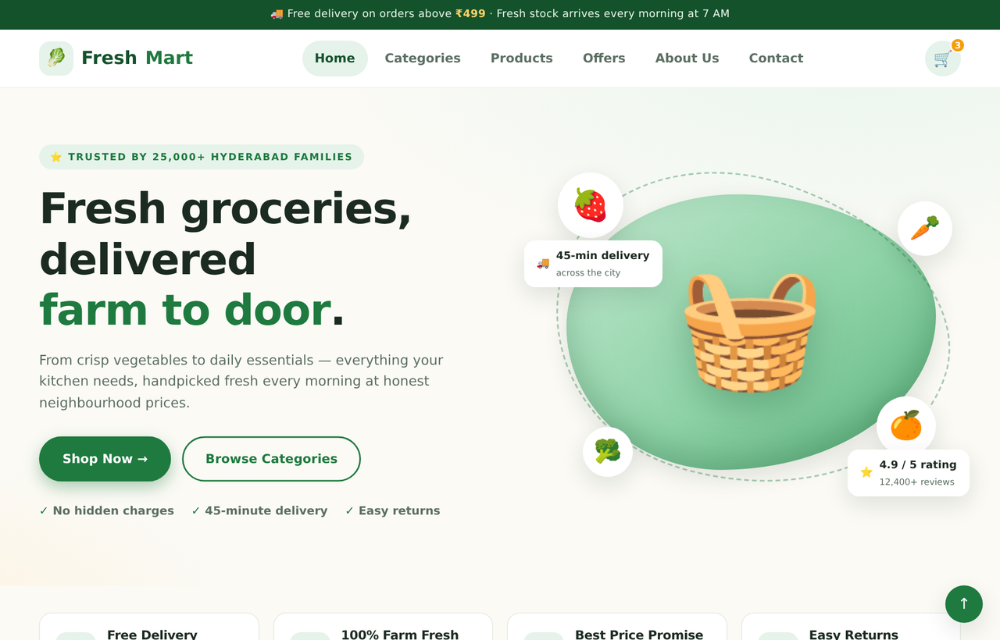
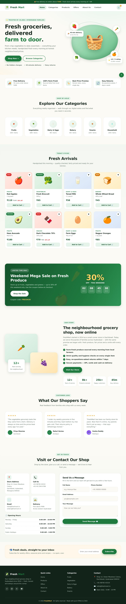

# 🥬 FreshMart — Grocery Shop Website


A fully responsive, multi-section grocery shop website built with **pure HTML5 and CSS3 — zero JavaScript, zero frameworks, zero libraries**. Every interaction, from the mobile hamburger menu to hover animations, is achieved with CSS alone.



---

## ✨ Features

| Section | Highlights |
|---|---|
| 🛒 **Product showcase** | 8 product cards with prices, discount badges (Sale / Organic / New), wishlist buttons & "Add to Cart" |
| 🏪 **Shop information** | Store story, stats, opening-hours table, address / phone / email cards & contact form |
| 🍽️ **Categories & offers** | 6 category cards + a weekend-sale banner with a static countdown |
| 💌 **Extras** | Testimonials, newsletter signup, announcement bar, back-to-top button |

## 🧩 CSS Concepts Demonstrated

- **CSS Grid & Flexbox** — every layout on the page (product grid, footer, contact section)
- **Custom properties (design tokens)** — colors, shadows and radii defined once in `:root`
- **Checkbox hack** — a working mobile hamburger menu with *no JavaScript*
- **Sticky positioning** — navigation bar that stays pinned on scroll
- **Media queries** — responsive breakpoints at 1024px, 860px and 560px
- **`clamp()` fluid typography** — headings scale smoothly with viewport width
- **Keyframe animations** — floating fruit, spinning dashed ring, hover lift effects
- **Accessibility** — semantic landmarks, aria labels, visible focus styles, `prefers`-friendly contrast

## 📁 Project Structure

```
grocery-shop/
├── index.html              # Semantic HTML5 markup
├── css/
│   └── style.css           # All styling (reset → tokens → sections → responsive)
├── assets/
│   ├── screenshot-home.png # Homepage preview
│   └── screenshot-full.jpg # Full-page preview
├── LICENSE
└── README.md
```

## 🚀 Getting Started

No build tools or dependencies needed — it's plain HTML & CSS.

```bash
git clone https://github.com/<your-username>/grocery-shop.git
cd grocery-shop
```

Then simply open `index.html` in any modern browser. (Optional: use the
*Live Server* extension in VS Code for auto-reload during development.)

## 🌐 Deploy on GitHub Pages

1. Push this repository to GitHub
2. Go to **Settings → Pages**
3. Under *Source*, select **Deploy from a branch** → `main` → `/ (root)`
4. Your site will be live at `https://<your-username>.github.io/grocery-shop/`

## 📸 Full-Page Preview

<details>
<summary>Click to expand the full-page screenshot</summary>



</details>

## 🧑‍💻 Author

Built as a frontend practice project to strengthen HTML5 & CSS3 fundamentals.

## 📄 License

Released under the [MIT License](LICENSE).
